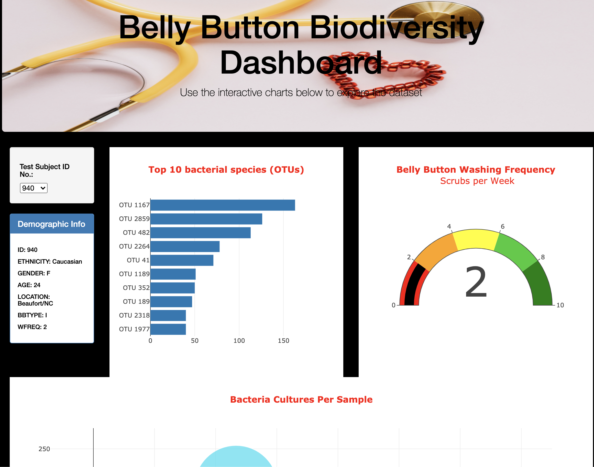

# Belly Button Biodiversity

## Overview:

In this project, I helped Roza to visualize the bacterial data for each volunteer. Specifically, her volunteers should be able to identify the top 10 bacterial species in their belly buttons. That way, if Improbable Beef identifies a species as a candidate to manufacture synthetic beef, Roza's volunteers will be able to identify whether that species is found in their navel.

To achieve that, I utilized Plotly.js, a JavaScript data visualization library, to create an interactive data dashboard for the web. Then, I deployed the project onto a GitHub public server so I can share the project with others.

